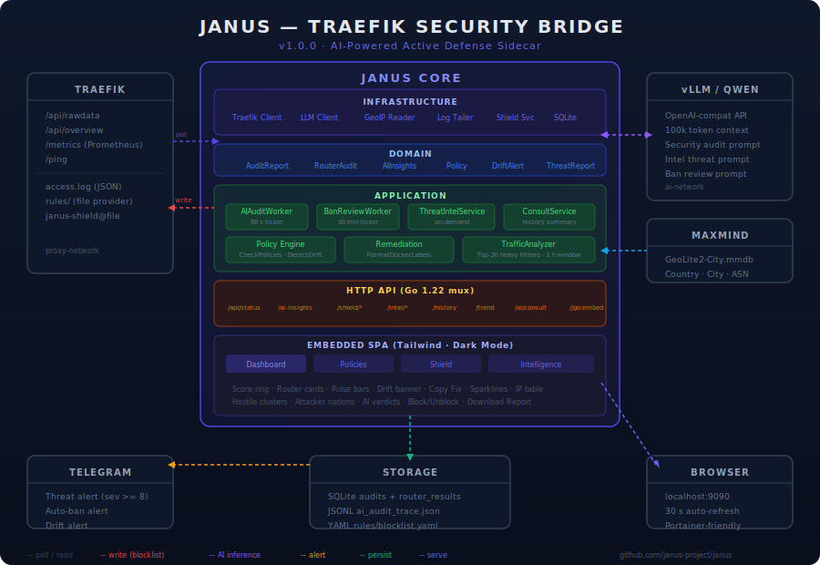

# Janus — Traefik Security Bridge

> **Version:** 0.8.0 · **License:** MIT · **Stack:** Go 1.22 · Docker · Tailwind CSS

Janus is a lightweight Go sidecar that runs alongside Traefik and bridges the gap between **DevOps** (who configures the proxy) and **Developers** (who need to understand what is exposed and how). It surfaces security gaps, detects active attacks, blocks hostile IPs, and delivers AI-powered threat intelligence — all from a single embedded dashboard.

---

## Architecture



Janus sits inside the same Docker network as Traefik (`proxy-network`) and polls Traefik's internal REST API. It never intercepts live traffic — it is a **read-only observer** paired with an **active write path** for the IP blocklist only.

---

## Feature Overview

| # | Stage | Feature |
| --- | --- | --- |
| 1 | Foundation | Security Scorer, Pulse Monitor, embedded SPA |
| 2–3 | AI Integration | vLLM / Qwen threat analysis, chain-of-thought, per-router attack surface |
| 4 | Remediation | Copy-Fix snippets, Telegram alerts, audit history |
| 5 | Policy Engine | Custom middleware policies, configuration drift detection, AI consult |
| 6 | SQLite Memory | Persistent audit history, 30-day score trend |
| 7 | Active Defense | IP blocklist (Shield), auto Fail2Ban, manual block/unblock |
| 7.1 | Prison Guard | Post-ban 403 log monitoring, AI "Watch & Forgive" auto-unblock |
| 8 | Threat Intel | GeoIP enrichment, Top-20 heavy-hitter analysis, hostile cluster detection |

---

## Dashboard Tabs

### Dashboard
- Security Score ring gauge (0–100, color-coded)
- Router red-flag cards sorted worst-first, each with issues, policy violations, AI reasoning, and a "📋 Copy Fix" button
- Pulse Monitor: error-rate bars per service
- Janus-AI section: executive summary, chain-of-thought, shadow APIs, bot-scan alerts with "🚫 Block" buttons
- Configuration drift orange banner
- Intelligence History: sparkline + sortable audit table

### Policies
- Policy definitions (pattern → required middlewares)
- Compliant / Non-Compliant status per router
- "Ask Janus-AI" button for a 3-paragraph executive security summary over the last 100 audits

### Shield
- Live blocked-IP list with SVG sparklines (30-min activity), PERSISTENT ATTACKER / COOLING DOWN AI verdict badges
- Unblock button per IP
- Manual IP block form
- Traefik wiring instructions

### Intelligence
- Top-20 most active IPs: country, city, hit count, error %, top router, AI verdict (HOSTILE / SUSPICIOUS / LEGITIMATE / UNKNOWN)
- Hostile cluster cards (description, target pattern, member IPs)
- Attacker nations table with threat level
- "🔍 Run Analysis" button (triggers async LLM cycle)
- "⬇ Download Report" — full AI-written Markdown threat assessment

---

## Quick Start

### Prerequisites

- Docker + Docker Compose
- An existing Traefik container attached to a Docker network named `proxy-network`

### Run

```bash
# 1. Clone
git clone https://github.com/janus-project/janus.git
cd janus

# 2. Copy and review environment config
cp .env.example .env

# 3. Start
docker compose up --build -d

# 4. Open the dashboard
open http://localhost:9090
```

---

## Environment Variables

### Core

| Variable | Default | Description |
| --- | --- | --- |
| `TRAEFIK_API_URL` | `http://traefik:8080` | Base URL of Traefik's API |
| `JANUS_PORT` | `9090` | Port Janus listens on |
| `JANUS_ENV` | `production` | Environment label sent to the AI |
| `JANUS_ALERT_THRESHOLD` | `0.10` | Pulse alert threshold (0.0–1.0) |
| `JANUS_POLICIES_PATH` | `/configs/policies.json` | Custom security policies file |
| `JANUS_KNOWN_MIDDLEWARES` | *(empty)* | Comma-separated list of trusted middleware names |

### AI (vLLM)

| Variable | Default | Description |
| --- | --- | --- |
| `VLLM_API_URL` | *(empty)* | vLLM base URL — AI features disabled when unset |
| `VLLM_MODEL` | `qwen2.5-7b-instruct` | Model name to request |
| `VLLM_API_KEY` | *(empty)* | API key (if required) |
| `JANUS_AI_INTERVAL` | `60` | AI audit interval in seconds |
| `JANUS_AI_TRACE_PATH` | `/logs/ai_audit_trace.json` | JSONL trace file path |

### Persistence

| Variable | Default | Description |
| --- | --- | --- |
| `JANUS_DB_PATH` | `/app/data/janus.db` | SQLite database path (empty = JSON fallback) |
| `JANUS_HISTORY_PATH` | `/logs/audit_history.json` | JSON history path (legacy fallback) |

### Shield (Active Defense)

| Variable | Default | Description |
| --- | --- | --- |
| `JANUS_SHIELD_PATH` | `/rules/blocklist.yaml` | Traefik dynamic-config blocklist file |
| `JANUS_AUTO_BLOCK_MIN` | `10` | Min AI severity (1–10) to trigger auto-block |
| `JANUS_ACCESS_LOG_PATH` | `/logs/access.log` | Traefik JSON access log path |

### Threat Intelligence

| Variable | Default | Description |
| --- | --- | --- |
| `JANUS_GEOIP_DB_PATH` | `/app/data/GeoLite2-City.mmdb` | MaxMind GeoLite2-City database path (optional) |

### Alerts

| Variable | Default | Description |
| --- | --- | --- |
| `TELEGRAM_BOT_TOKEN` | *(empty)* | Telegram bot token (alerts disabled when unset) |
| `TELEGRAM_CHAT_ID` | *(empty)* | Target Telegram chat ID |
| `TELEGRAM_SEVERITY_THRESHOLD` | `8` | Min severity to trigger a Telegram alert |

> **Portainer:** set these directly in the stack's "Environment variables" panel. No `.env` file needed.

---

## API Reference

| Method | Path | Description |
| --- | --- | --- |
| `GET` | `/api/status` | Full security audit snapshot |
| `GET` | `/api/v1/ai-insights` | Latest AI analysis JSON |
| `GET` | `/api/v1/ai/consult` | On-demand executive AI summary |
| `GET` | `/api/v1/history` | Audit history (last 100 entries) |
| `GET` | `/api/v1/trend?days=N` | Score trend (SQLite, default 30 days) |
| `GET` | `/api/v1/shield` | Blocked IPs + activity sparklines + AI verdicts |
| `POST` | `/api/v1/shield/block` | Block an IP — body: `{"ip":"x.x.x.x"}` |
| `POST` | `/api/v1/shield/unblock` | Unblock an IP — body: `{"ip":"x.x.x.x"}` |
| `GET` | `/api/v1/intel` | Latest threat intelligence report JSON |
| `POST` | `/api/v1/intel/analyze` | Trigger background intel analysis |
| `GET` | `/api/v1/intel/report` | Download Markdown threat report |

---

## Project Structure

```text
janus/
├── cmd/janus/main.go              # HTTP server, all API handlers, config
├── go.mod                         # Go 1.22; minimal external deps
├── Dockerfile                     # Multi-stage → scratch image
├── docker-compose.yml             # Joins proxy-network + ai-network
├── .env.example                   # All environment variables documented
├── VERSION                        # SemVer (currently 0.8.0)
├── CHANGELOG.md                   # Full release history
├── configs/
│   └── policies.json              # Default security policies (embedded)
├── docs/
│   └── infographic.svg            # Architecture diagram
├── domain/                        # Pure domain layer — zero external deps
│   ├── analyst.go                 # AIInsights, RouterInsight, AggressivityAlert
│   ├── audit.go                   # AuditReport, RouterAudit, SecurityIssue
│   └── policy.go                  # Policy, DriftAlert
└── internal/
    ├── app/                       # Application / use-case layer
    │   ├── consult.go             # ExecutiveSummary use case
    │   ├── drift.go               # DetectDrift
    │   ├── intel.go               # ThreatIntelService
    │   ├── policy.go              # CheckPolicies, LoadPolicies
    │   ├── remediation.go         # FormatDockerLabels
    │   ├── review.go              # BanReviewWorker
    │   ├── trace.go               # JSONL audit trace writer
    │   └── worker.go              # AIAuditWorker (60-second ticker)
    ├── infrastructure/
    │   ├── firewall/shield.go     # ShieldService (blocklist YAML)
    │   ├── geoip/reader.go        # MaxMind GeoLite2 wrapper
    │   ├── llm/                   # vLLM client + all system prompts
    │   ├── logs/                  # AccessLogTailer + TrafficAnalyzer
    │   ├── storage/               # SQLiteRepository + JSON Repository
    │   ├── telegram/notifier.go   # Telegram alert sender
    │   └── traefik/               # Traefik API client + ACL mapper
    ├── pulse/                     # Prometheus text-format parser
    ├── security/                  # Security Scorer
    └── web/static/index.html      # Embedded Tailwind SPA (4 tabs)
```

---

## Shield Setup (Traefik Integration)

For the IP blocklist to take effect in Traefik, mount the rules directory and enable the file provider:

```yaml
# traefik/docker-compose.yml (excerpt)
command:
  - --providers.file.directory=/rules
  - --providers.file.watch=true
  - --accesslog=true
  - --accesslog.filepath=/logs/access.log
  - --accesslog.format=json
volumes:
  - /opt/traefik/rules:/rules
  - /opt/janus/logs:/logs
```

Then add the middleware to any router you want protected:

```
traefik.http.routers.myapp.middlewares=janus-shield@file
```

---

## GeoIP Setup (Threat Intelligence)

1. Register for a free MaxMind account at <https://www.maxmind.com>
2. Download `GeoLite2-City.mmdb`
3. Place it in the `data/` volume: `/opt/janus/data/GeoLite2-City.mmdb`

If the file is absent, Janus starts normally — geo fields will show `--`.

---

## Docker Network

Janus joins two existing external networks — it never creates them:

```yaml
networks:
  proxy-network:
    external: true   # shared with Traefik
  ai-network:
    external: true   # shared with vLLM container
```

---

## Versioning

Janus follows [Semantic Versioning](https://semver.org/). The current version is tracked in [VERSION](VERSION) and full release history in [CHANGELOG.md](CHANGELOG.md).

---

## Philosophy

Janus (the two-faced Roman god) looks in two directions simultaneously:

- **Inward** — reads Traefik's internal state and access logs
- **Outward** — presents clear, actionable intelligence for both DevOps and Developers

It does not replace Traefik's dashboard, Prometheus, or Grafana. It is the **fast, zero-configuration security bridge** for teams who need situational awareness and active defense without standing up a full observability stack.

---

## Author

Ricardo Dias — Software Engineer — Portugal

[](https://ricardo.grangeia.dias)
[](mailto:ricardo@grangeia.pt)

---

## License

MIT — see [LICENSE](LICENSE).
